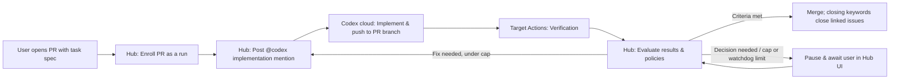

# Architecture

## Purpose and Scope

A single Hub manages multiple project connections. Each connection points to one GitHub repository. The number of internal modules within a repository is independent of this mapping.
Hub has no external issue tracker. Work is specified in pull requests the user opens, and its progress is held by Hub's own run state and UI.
The initial implementation begins with PR observation per connection.

## Responsibility Boundaries

| Component | Responsibility |
| --- | --- |
| User | Opens the PR with the task specification and acceptance criteria, enrolls it in Hub, resolves paused runs |
| Hub Core Gate | External state interpretation, next action decisions, deduplication, retries, pause/resume |
| Hub Project Policy | Required workflows/jobs, concurrency limits, revision caps, merge criteria |
| Codex Mention Dispatch | Self-contained implementation/fix requests posted as PR comments, and correlation of their outcomes |
| Codex cloud | Implements the request in its repository environment and pushes to the PR branch |
| Target Repo Actions | Runtime and dependency installation, test environments (e.g. databases), lint/test/build |
| Target Repo | Development guidelines (`AGENTS.md`), tests, project-specific quality standards |

Hub does not checkout target repositories to run arbitrary verification commands.
Project-specific conditions must be expressed through CI checks or review guidelines.
Reusable environment setup is provided via templates, and later through version-pinned reusable workflows.
Branching gates based on repository names or introducing a custom pipeline language are excluded from the initial scope.

Decision logic lives in Hub. Unlike the `g-sandbox` plan to keep verdict logic in the target repository and move only triggers to a hub, Hub owns stage decisions, caps, and merge conditions, while repositories own CI and guidelines.

## Progression Model

The target pipeline is structured as follows. The current implementation scope covers the CI observation stage.

Scheduled tasks inspect the current state, perform bounded necessary actions, and exit immediately.
They do not keep HTTP requests open waiting for long-running Codex executions or CI completions.
The initial version relies on periodic polling; later, GitHub webhooks and periodic recovery will feed into the same observation and evaluation path.

## State Ownership

- `ScheduleConfig` / `ScheduleJob`: When to observe and the single tick execution result.
- Current `TaskState`: The latest read-only observation report. Not an execution history or permanent audit log.
- `ProjectConnection`: The persistent model for the repository, its connectors, the required-job contract, and the last connection check.
- `PipelineRun` / `ExecutionAttempt`: Durable state spanning PR enrollment to merge, immutable request snapshots, idempotency IDs, mention deliveries, external correlation, pause reasons, and retry/recovery history.
- GitHub: Source of truth for PR heads and bodies, comments, check runs, and actual merge status.
- Codex cloud: No task-status API. Hub observes it only through its PR comments and pushes to the PR branch.

A repository maps to exactly one project connection, enforced by a unique constraint on `ProjectConnection`.
`pipeline.observe_project` schedules reference only `project_id` and PR numbers, so the connection is resolved at run time and an edit can never leave a schedule holding a stale contract.
Every edit bumps `revision`; observations and connection checks that started against an older revision are discarded rather than saved.

A partial unique index permits only one active (in-flight, paused, or blocked) run per pull request; different pull requests of a project run in parallel. A project may cap how many of its runs are with an agent or in CI at once (`automation.max_in_flight_runs`): further runs stay queued, and paused or blocked runs hold no slot. Workers use short database leases; acquire, renew, release, and expiry reclamation are conditional writes, and lease tokens are exposed only by lease operations.
Before delegation, Hub commits an immutable request, canonical SHA-256 digest, idempotency key, and correlation marker under the run lease. A retry with the same request reuses that active attempt; a changed request is rejected. The provider port separates this transaction from reconciliation and the later external mutation.

Legacy `pipeline.observe` schedules that still carry their connection inline are migrated explicitly and transactionally through `POST /api/v1/projects/import_schedule`, which keeps the schedule's trigger, PR numbers, enabled state, and history.

## Prerequisites Before Introducing External Writes

Read-only observation stores only the latest report containing timestamps and observed targets.
Because overlapping observations can overwrite earlier runs with later-finishing results, observation alone must never serve as justification for merges.

When introducing external writes:
- Lease mechanisms at the repo/PR/action level and unique idempotency request identifiers must be recorded in the DB.
- PostgreSQL's `FOR UPDATE SKIP LOCKED` during schedule selection only controls schedule selection—it does not guarantee exactly-once execution against external APIs.
- Even if a process crashes after an external request succeeds but before the DB commit, it must be able to find the posted comment by its marker and resume instead of posting again.
- Never run concurrent, competing progression gates inside GitHub Actions.

The execution path is a Codex task started by an `@codex` comment on the enrolled PR, following the protocol proven in `g-sandbox` (D-013, D-017) and specified in [Codex PR Mention Protocol](codex-pr-mention.md). Two constraints shape the design:

- The mention must be posted with a user PAT whose GitHub account is linked to Codex. Mentions from the Actions `GITHUB_TOKEN` get no response, and bot pushes do not trigger CI.
- Codex does not reliably push to the existing branch on its own. Its environment carries a repository-scoped `GH_TOKEN`, and every mention includes an explicit push command for the PR branch.

GitHub remains the source of implementation artifacts: a Codex reply alone does not prove that code was pushed. Hub treats a change of the PR head away from the head recorded in the request marker as the implementation signal, then evaluates CI on that head.

Workspace Agents API triggers published ChatGPT workspace agents and is not a Codex cloud task API. `openai/codex-action` in the target repository's Actions remains the fallback adapter if the mention path becomes unusable; it keeps the same run, attempt, lease, and idempotency contracts but bills an OpenAI API key.

Immediately prior to merging, the latest PR head and base, required checks, reviews, and branch protection rules must be re-verified.
Automatic merges must not rely solely on CI passing at the time of an earlier observation.

Hub re-observes the pull request and its required jobs itself, and takes reviews and branch rules from GitHub's own verdict (`mergeable_state`) rather than re-implementing them:

| `mergeable_state` | Hub's action |
| --- | --- |
| `dirty`, `behind` | The branch conflicts with or trails its base: one `conflict-fix` request asks the agent to merge the base in (unless `auto_fix_conflicts` is off). No merge is attempted. |
| `blocked`, `draft` | A person has to act (an approval, a branch rule, leaving draft). The run stays in `awaiting_ci` with the reason, is rechecked every 5 minutes, and merges by itself afterwards. Nothing is sent to the agent. |
| anything else, or not computed yet | Hub asks GitHub to merge the verified head. A refusal (HTTP 405/409) is classified by re-reading the state: only `dirty`/`behind` goes to the agent, everything else waits as above. |

A waiting run is deliberately not paused: resuming a paused run replays its last request to the agent, and nothing here is the agent's to redo.

## GitHub Failures

The GitHub client classifies a failed response from its status and rate-limit headers, never from its body.

| Kind | Signal | Scheduled tick |
| --- | --- | --- |
| `rate_limited` | 429, or 403 with `Retry-After` or `X-RateLimit-Remaining: 0` | The run's `next_action_at` moves out by the delay GitHub names (60 seconds to 1 hour). Not a failure. |
| `auth` | 401 | The run keeps its state, records that the connector's token was rejected, and is rechecked every 15 minutes; it continues by itself once the token is replaced. Not a failure. |
| `upstream` | anything else | The tick's job fails, as before. |

A run holding a reason while in flight is announced once through [Operator Notices](operator-notices.md), like a stopped run. An AI catalog that cannot take more work yet (a quota hold, its concurrency limit) is backpressure, not a failed job. API calls made by a person still return these errors directly.

## Elements Adopted from g-sandbox

We adopt principles such as the PR snapshot → decision structure, missing task reclamation, bounded revision counts, pause/resume semantics, and reuse of existing PRs/requests.
From its PR gate we also adopt the Codex mention protocol: user-PAT mention identity, self-contained prompts with an explicit push block, head-movement completion detection, trusted-author marker filtering, and the silent/usage-limit watchdog.
However, external issue-tracker backlogs and HITL queues, stub PR creation, `notes/*.md` project discovery, Godot installation / direct execution of `check.sh`, planning/prototype/maturity policies, and repo-specific marker compatibility are not part of the core migration scope.
