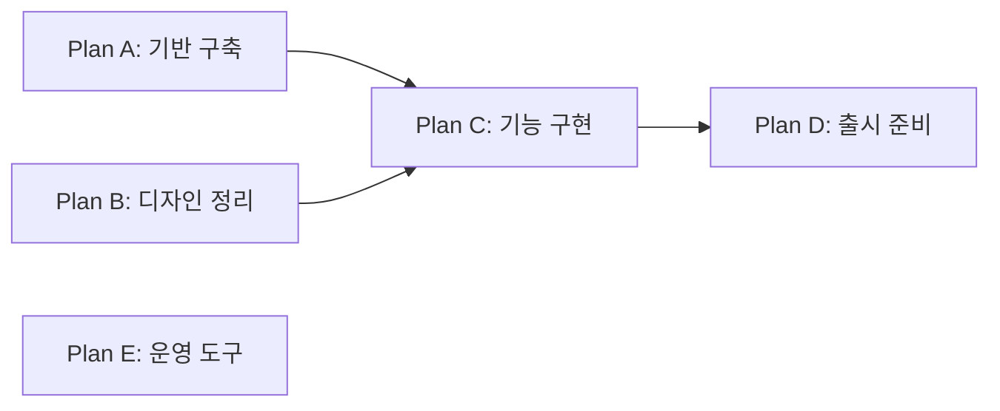

# 작업 묶음과 의존성 실행 설계

2026-09-22 논의 정리. **합의와 초기 제안을 기록한 설계 문서다.**
초기 로컬 구현과 확정한 세부 동작·제한은 [구현 가이드](work-plans.md)를 참고한다. 운영 배포는 아직 하지 않았다.
대화에서 합의한 동작과 구현 시 구체화할 제안을 구분한다.
현재 구현은 [실행 구조](architecture.md), [보관 정책](operator-notices.md#history-retention),
[구현·검증 현황](delivery-status.md)을 기준으로 한다.

## 목적과 합의한 사용 흐름

사용자는 여러 작업과 원하는 의존 관계를 한 번에 등록한다. AutoHub는 의존성이
충족된 작업을 실행 용량 안에서 병렬 처리하고, 선행 작업의 머지 후 후속 작업을
자동으로 시작한다. 여러 묶음을 연결하면 마일스톤 순서도 표현할 수 있다.

- 묶음 등록 자체가 실행 요청이다. 별도 묶음 승인 단계는 두지 않는다.
- 구현·검증은 실행 조건이 충족되는 대로 진행한다.
- 머지는 프로젝트 정책을 따른다. 원하는 기본 동작은 자동 머지다.
- 선행 작업의 완료 기준은 지정한 대상 브랜치에 PR이 머지된 것이다.
  에이전트 응답, 구현 종료, CI 통과만으로 후속 작업을 해제하지 않는다.
- 의존성이 없는 묶음과 작업은 프로젝트·AI Catalog의 동시 실행 제한 안에서
  병렬 진행할 수 있다. 의존성 대기는 실행 슬롯을 차지하지 않는다.
- Plan의 pause/revoke는 아직 시작하지 않은 Item을 제어한다.
  이미 시작한 실행을 외부 시스템에서 중단할 필요는 없다.

## 현재 구조와 추가할 책임

| 단위 | 현재 또는 제안하는 책임 |
| --- | --- |
| `ScheduleJob` — 현재 | 스케줄러 한 번 실행의 상태·결과·재시도. 성공해도 개발 작업이 끝났다는 뜻은 아니다. |
| `PipelineRun` — 현재 | PR 하나의 등록부터 구현·CI·수정·머지까지 지속적인 lifecycle. pause/resume, 실패·취소, lease와 복구를 관리한다. |
| `ExecutionAttempt` — 현재 | Run 안의 개별 구현·CI 수정·충돌 수정 요청과 실행 상태. |
| `WorkPlan` — 제안 | 작업 묶음의 명세, Plan 간 의존성, 새 작업 시작 제어, 묶음 결과. |
| `WorkItem` — 제안 | PR 생성 전부터 존재하는 작업 명세·완료 조건, 동일 Plan 내부 의존성, 실행 연결과 영속적인 결과. |

```text
WorkPlan
  └─ WorkItem
       └─ PipelineRun
            └─ ExecutionAttempt

Scheduler / ScheduleJob: 위 상태를 주기적으로 관찰하고 필요한 처리를 진행
```

현재 `PipelineRun`은 PR 번호와 브랜치가 필수다. Plan·Item은 그 앞단에서
실행 순서와 대기를 관리하고, 실행 가능한 Item의 브랜치·PR을 준비한 뒤
기존 Run 파이프라인으로 넘긴다. Item에 CI 수정이나 에이전트 응답 처리 로직을
중복 구현하지 않는다. 재실행이나 PR 교체가 필요해도 의존 관계는 안정적인
Item ID를 참조한다. 한 Item의 중복 활성 실행은 막는다.

Run을 관찰한 Job이 정상 종료해도 Run은 계속 구현 중일 수 있다.
다음 Job이 같은 Run을 다시 관찰한다. Plan·Item을 추가해도 이 실행 방식은 유지한다.

## 의존 관계: 영구적인 도메인 제약

다음 제한은 초기 버전의 타협이 아니라 앞으로도 유지할 규칙이다.

| 관계 | 지원 여부 |
| --- | --- |
| Plan → Plan | 지원. 모든 선행 Plan이 성공 완료되면 후속 Plan을 해제한다. |
| 동일 Plan 내부 Item → Item | 지원. 모든 선행 Item이 머지되면 후속 Item을 해제한다. |
| 서로 다른 Plan의 Item → Item | 영구적으로 지원하지 않는다. |
| Plan → Item 또는 Item → Plan 직접 참조 | 지원하지 않는다. |

Plan 그래프와 각 Plan의 Item 그래프는 각각 순환 없는 방향 그래프다.
자기 참조, 순환, 존재하지 않는 대상, 다른 Plan의 Item 참조는 등록·수정 시 거부한다.
UI 선택 범위뿐 아니라 API와 저장 무결성에서도 같은 규칙을 적용한다.
다른 Plan의 일부 결과만 먼저 필요하면 해당 부분을 별도 Plan으로 분리한다.



A·B·E는 용량 안에서 병렬 진행한다. A와 B가 모두 완료되면 C, C가 완료되면
D를 해제한다. C 내부에서도 Item별 의존 관계에 따라 실행한다.

Item의 시작 조건은 다음을 모두 만족하는 것이다.

1. 소속 Plan이 새 실행을 허용한다. pause/revoke 상태가 아니다.
2. 소속 Plan의 모든 선행 Plan이 성공 완료됐다.
3. 동일 Plan 내부의 모든 선행 Item이 성공 완료됐다.
4. Item이 미착수 상태이고, 기존 실행이나 시작 예약과 중복되지 않는다.
5. 프로젝트·Catalog 정책과 실행 용량이 시작을 허용한다.

의존성 해제와 실제 시작은 구분한다. 실행 가능해도 quota나 concurrency 때문에
대기할 수 있다. 특정 선행 작업의 실패는 그 후속 작업만 막으며 독립적인 작업은
계속 진행한다. 실패·취소·revoke는 성공으로 간주하지 않는다.

## PR 준비와 머지 정책

작업 명세는 모두 미리 등록하되, 브랜치와 PR은 Item을 실제 실행할 때 준비한다.
선행 변경이 반영된 대상 브랜치에서 시작해야 한다. 선행 PR이 머지됐다는 확인과
후속 실행의 기준 커밋을 기록해, 오래된 브랜치에서 잘못 출발하지 않도록 한다.

현재 Codex 실행 경로에는 PR이 필요하므로 일반 작업용 브랜치·PR 준비 기능이
추가로 필요하다. PR 생성 및 실행 요청은 의도를 먼저 저장하고, 재시작이나
외부 응답 유실 시 기존 결과를 찾아 복구해 중복 생성을 막는다.

현재 구현은 `auto_merge=true`여도 Draft PR을 사용자가 Ready로 바꾸기 전까지
머지하지 않는다. Plan 등록 후 별도 승인을 요구하지 않으려면 자동 생성 PR의
Draft 처리와 프로젝트 머지 정책의 연결을 구현 시 조정해야 한다.
자동 머지 정책에서는 별도 Ready 조작 없이 CI 검증 후 머지까지 진행할 수 있어야 한다.
수동 머지 정책에서는 PR 머지를 기다리고, 후속 Item·Plan도 함께 대기한다.
사람이 다시 Draft로 전환한 경우 같은 명시적 보류 신호를 무시해서는 안 된다.

의존성이 없는 작업도 같은 파일을 수정할 수 있다. 병렬 구현이 충돌 없는 머지를
보장하지 않으므로 기존 충돌 수정과 머지 직전 최신 head/base·CI 확인을 유지한다.

## Plan pause / resume / revoke

합의한 범위는 **대기 중인 Item의 새 실행 제어**다. 이미 시작한 Run을 멈추거나
외부 에이전트 실행을 취소하는 기능으로 해석하지 않는다.

다음 표는 이 범위를 구체화한 동작 제안이다. 특히 revoke의 비가역성과
시작 경계는 구현 전에 API·UI 용어와 함께 확정한다.

| 조작 | 미착수 Item | 이미 시작한 Item / Run |
| --- | --- | --- |
| Pause | 새 시작을 보류한다. 의존성이 해제돼도 시작하지 않는다. | 관찰·구현·CI 수정·충돌 수정·프로젝트 정책에 따른 머지를 계속한다. |
| Resume | 현재 의존성과 용량을 다시 평가해 시작한다. | 기존 Run을 재시작하거나 요청을 중복 전송하지 않는다. |
| Revoke | 남은 실행 요청을 철회한다. 미착수 Item을 철회 상태로 남기고 자동 실행하지 않는다. | 기존 Run을 계속 처리하고 실제 결과를 기록한다. 이미 한 머지를 되돌리지 않는다. |

제안하는 추가 규칙:

- Pause는 일시 보류이며 Resume으로 해제한다. Revoke는 남은 작업의 최종 철회이며
  일반 Resume으로 되살리지 않는다. 다시 수행할 작업은 새 Plan으로 등록한다.
- Plan의 실행 허용 상태와 진행 중/성공/실패/철회 Item 수를 구분해 보여준다.
  `revoked`여도 이미 시작한 Item은 여전히 실행 중일 수 있다.
- Pause 중 모든 Item이 성공 완료됐다면 완료를 반영할 수 있다. Pause는 신규
  시작만 막는다. 완료된 선행 Plan은 후속 Plan의 조건을 충족한다.
- Revoke한 Plan은 성공한 Plan으로 취급하지 않는다. 이미 시작한 Item들의 결과는
  보존하되 후속 Plan은 자동 해제하지 않는 것을 기본 제안으로 한다.
- 후속 Plan을 자동으로 pause/revoke하지는 않는다. 선행 조건 미충족 사유를
  표시하며 기다린다. 이미 시작한 후속 실행을 소급 중단하지 않는다.
- 완료된 Plan에는 pause/revoke를 적용하지 않는다.

### 시작 경계와 동시 요청

제안하는 시작 경계는 **Item의 실행 시작을 DB에 원자적으로 확정하는 시점**이다.
그 뒤 브랜치·PR 준비와 Run 연결을 진행한다. 단순 큐 조회나 후보 선택은 시작이 아니다.

Pause/revoke와 시작 확정은 같은 Plan의 제어 상태·revision을 기준으로 직렬화한다.
제어 요청이 먼저 확정됐다면 기존 큐 후보도 시작할 수 없다. 시작 확정이 먼저라면
이미 시작한 Item으로 처리하고 계속 진행할 수 있다. 진행 중 숫자에는 이 준비 단계도
포함해 사용자가 경계를 알 수 있게 한다.
외부 요청이 전송됐는지 불확실한 시작은 미착수로 되돌려 새 요청을 보내지 말고
기존 실행을 조회·복구한다.

## 완료 결과와 이력 보관

### 현재 정책

| 대상 | 현재 보관 정책 |
| --- | --- |
| 성공 ScheduleJob | 종료 후 3일 |
| 실패 ScheduleJob | 종료 후 7일. 재시도 가능한 Job은 보존 |
| `completed`·`failed`·`canceled` PipelineRun | 마지막 변경 후 30일 |
| 진행 중·`paused`·`blocked` PipelineRun | 자동 삭제하지 않음 |
| 유효한 lease가 있는 Run | 삭제에서 제외 |

최대 시간당 한 번, Run 200개·Job 1,000개까지 정리한다. Run의 Attempt·Delivery·Reply도
함께 삭제된다. GitHub PR·브랜치는 이 정책으로 삭제하지 않는다.
Jules session은 Run 만료 표시와 PR URL·보고서를 남겨 동일 PR 재등록을 막는다.

### Plan·Item을 위한 제안

**Run이 없다는 이유로 성공 처리하지 않는다.** 현재도 실패·취소 Run이 삭제되므로
부재는 성공 증거가 될 수 없다. 의존성 판단에는 Run의 존재가 아니라 Item·Plan에
보존한 명시적인 성공 결과를 사용한다.

Item에는 최소한 결과, 완료 시각, 저장소·PR 식별자와 URL, 대상 브랜치,
머지 커밋, 실행 식별자를 남긴다. Run 상세가 만료돼도 결과를 읽을 수 있어야 한다.
Plan은 모든 Item의 성공 결과를 확인해 묶음 완료를 기록한다.

- 성공 Run은 Item 결과가 안전하게 반영된 후 기존 30일 보관 정책을 적용할 수 있다.
- 미해결 Item의 복구·조사에 필요한 실패 Run은 자동 삭제에서 제외한다.
  재시도로 해결하거나 명시적으로 작업을 종료한 뒤 보관 기간을 적용하는 방안을 쓴다.
  해결 전에 이미 오래됐다는 이유로 즉시 지워지지 않도록 보관 기산점도 정해야 한다.
- 진행 중·paused·blocked·유효 lease 보호는 유지한다.
- 취소·철회 결과도 명시적으로 남긴다. 정리 과정에서 성공으로 바꾸지 않는다.
- 첫 버전에서는 Plan·Item 명세, 의존 관계와 최종 결과를 자동 삭제하지 않는다.
  Run 이력이 만료돼도 선행 Plan·Item의 성공 여부는 계속 판단할 수 있다.
- Run 결과 반영과 삭제가 경쟁하지 않게 한다. 같은 트랜잭션에서 결과를 기록하거나,
  결과 반영 완료를 확인한 Run만 정리 대상으로 선택한다.
- 정상 만료는 별도 표시하고, 성공 결과 없이 연결된 Run이 사라진 경우는 확인 필요
  상태로 둔다. 후속 실행을 보류하고 GitHub의 실제 머지 증거로 복구한다.

보관 여부는 단순 경과 기간뿐 아니라 **의존성 판단 결과가 보존됐는지,
미해결 작업의 복구에 실행 상세가 필요한지**를 함께 확인한다.
독립 실행 Run과 기존 Jules 만료 처리도 호환되도록 유지한다.

## GitHub Issue: 실행과 분리된 기록 동기화

추가 합의: GitHub Issue는 저장소에서 명세와 작업 처리 이력을 확인하는 사본이다.
실행 상태·의존성·성공 여부의 기준은 AutoHub다. PR의 실제 코드·CI·머지 상태는
기존처럼 실행 판단에 사용하지만 Issue의 본문·댓글·닫힘·재개·관계는 사용하지 않는다.

- Plan은 부모 Issue, Item은 sub-issue로 기록하고 PR 링크와 주요 상태 이력을 남긴다.
- 의존 관계는 표시용이다. GitHub에서 관계를 수정해도 AutoHub 실행은 바뀌지 않는다.
- AutoHub → GitHub 단방향이며 GitHub 편집을 명세로 가져오거나 실행 트리거로 쓰지 않는다.
- Issue 생성·갱신 실패와 API 제한은 동기화 큐에서 재시도한다. 작업 실행을 막지 않는다.
- 자동 생성 의도와 식별자를 보존해 응답 유실 후 중복 Issue 생성을 막는다.
- 매 polling 기록 대신 주요 상태 변화를 남긴다. Issue에는 기록용 안내를 표시한다.
- 무료 private 저장소에서도 사용 가능하다. REST 요청/콘텐츠 생성 속도 제한과
  부모당 sub-issue 100개 제한은 구현 시 반영한다.

## 입력·변경·화면 제안

- Plan과 Item 목록·의존 관계를 일괄 검증한 뒤 원자적으로 등록한다.
  잘못된 묶음 일부만 먼저 실행하지 않는다.
- Item 의존 대상은 같은 Plan 내부에서만 고를 수 있게 한다.
- 선행 Plan 대기, 선행 Item 대기, 용량 대기, Plan pause, 승인/수동 머지 대기,
  실패 확인 필요, 철회를 서로 구분해 보여준다.
- Plan 상세에서 Item 관계·진행 상황을 보고, 실행 상세는 Run·Attempt로 이동한다.
  Run 만료 후에도 완료 결과와 PR 링크는 표시한다.
- 아직 시작하지 않은 작업의 명세·관계 변경은 재검증한다. 이미 시작한 작업에
  새 선행 조건을 붙여 실행 조건을 소급 변경하지 않는다.
- 완료된 Plan은 고정한다. 추가 작업은 새 Plan으로 등록해 이미 해제된 후속 Plan의
  전제를 뒤집지 않는다.

## 구현 전에 남은 결정

- 첫 범위는 한 프로젝트/저장소의 Plan으로 제한하는 안을 제안한다.
  서로 다른 프로젝트의 Plan 간 의존 여부는 아직 합의하지 않았다.
  허용하더라도 서로 다른 Plan의 Item 간 의존 금지는 바뀌지 않는다.
- 기본 대상 브랜치, PR 준비 방법, 프로젝트 머지 정책과 Draft 처리의 구체적인 연결.
- Pause/revoke의 시작 경계, revoke 후 재요청 방식과 완료 판정의 세부 UX.
- 실패 Run의 보호 해제 조건·보관 기산점, Run 만료 표시와 Item 실행 이력 연결 방식.
- 빈 Plan 허용 여부, 진행 중 Plan의 Item 추가·삭제 범위, 재시도·PR 교체 API.

자동 작업 분해/WBS 생성, 임의의 파이프라인 언어, 미머지 부모 브랜치 위의 선행 실행은
이번 설계에 포함하지 않는다. 먼저 명시적인 Plan·Item과 의존 관계를 실행하는 구조를 만든다.

## 구현 검증 기준

1. 의존성 없는 Plan·Item은 용량 안에서 병렬 실행하고, 여러 부모는 모두 성공해야 해제된다.
2. 다른 Plan의 Item 참조, 자기 참조와 순환을 등록·수정 모두에서 거부한다.
3. 선행 CI 통과만으로 해제하지 않고, 머지 결과가 포함된 기준에서 후속 작업을 시작한다.
4. 한 작업의 실패가 독립적인 작업을 막지 않으며 실패·취소·철회가 후속 성공 조건을 충족하지 않는다.
5. Pause/revoke와 시작 확정의 경쟁, Resume, 준비 도중 재시작에도 중복 PR·실행이 생기지 않는다.
6. Pause/revoke 후 기존 Run은 관찰·수정·머지를 계속하고 대기 Item의 새 실행만 제어한다.
7. 성공 Run 삭제 후에도 의존성 판단이 같고, 미해결 실패·paused·blocked Run은 보호된다.
8. 결과 반영과 정리가 동시에 실행돼도 성공 증거가 유실되지 않고, 원인 불명의 Run 부재는 성공이 아니다.
9. 수동 머지 정책은 머지를 기다리고, 자동 머지 정책은 별도 묶음 승인 없이 진행한다.
10. 기존 독립 PR 실행, Catalog 용량 관리, Jules session의 만료 후 재등록 방지가 유지된다.
